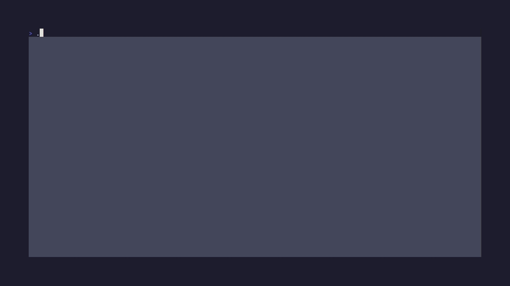
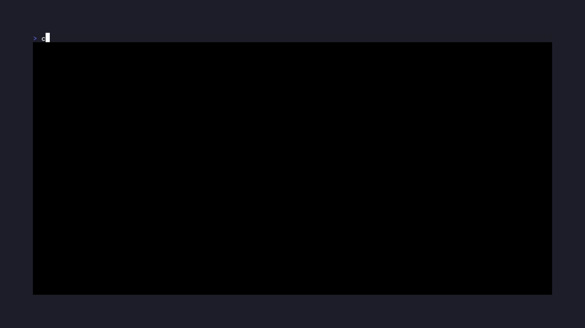

<p align="center">
    
</p>

👋 Hello! goread is an RSS/Atom feed reader for the terminal. It allows you to categorize and follow feeds and read articles right in the commandline! It's accompanied by a beautiful TUI made with [bubble tea](https://github.com/charmbracelet/bubbletea). Features include:

- Categorizing feeds
- Downloading articles for later use
- Offline mode
- Customizable colorschemes
- OPML file support
- A nice and simple TUI

## ❤️ Getting started

### Installing with `go install`

You can install goread using the `go` internal package manager

```
$ go install github.com/TypicalAM/goread@latest
```

### Installing with `homebrew`

If you use [Homebrew](https://brew.sh/), you can install [goread](https://formulae.brew.sh/formula/goread) via:

```
$ brew install goread
```

### Installing from AUR

If you use the [AUR](https://aur.archlinux.org/), you can install [goread](https://aur.archlinux.org/packages/goread) via:

```
$ yay -S goread
```

```
$ yay -S goread-bin # Release binary
```

## 📸 What does it look like?

Here is a gif of some basic usage:

<p align="center">
    
</p>

You can use a colorscheme from `pywal` to create a goread colorscheme!

<p align="center">
    
</p>

## ⚙️ Configuration

### 📝 The urls file

The urls file contains the categories and feeds that you are subscribed to! This file is generated by the program in the config directory (usually `~/.config/goread/urls.yml`) and looks similar to this:

```yaml
categories:
  - name: News
    desc: News from around the world
    subscriptions:
      - name: BBC
        desc: News from the BBC
        url: http://feeds.bbci.co.uk/news/rss.xml
        blacklist_words:
          - example
  - name: Tech
    desc: Tech news
    subscriptions:
      - name: Wired
        desc: News from the wired team
        url: https://www.wired.com/feed/rss
      - name: Chris Titus Tech (virtualization)
        desc: Chris Titus Tech on virtualization
        url: https://christitus.com/categories/virtualization/index.xml
        whitelist_words:
          - qemu
```

You can edit this file with `goread edit urls` to change the app's contents in an automated manner (remember that you can also edit entries in the TUI!).

### 🌃 The colorscheme file

The colorscheme file contains the colorscheme of your application! It can be generated by hand or using
the `--dump_colors` flag. The colorscheme file is usually at `~/.config/goread/colorscheme.json` - here is how it looks like!

```json
{
  "bg_dark": "#161622",
  "bg_darker": "#11111a",
  "text": "#FFFFFF",
  "text_dark": "#47485b",
  "color1": "#c29fec",
  "color2": "#ddbec0",
  "color3": "#89b4fa",
  "color4": "#e06c75",
  "color5": "#98c379",
  "color6": "#fab387",
  "color7": "#f1c1e4"
}
```

You can use the `--get_colors` flag to generate a colorscheme from pywal. For that you have to supply it with the pywal `colors.json` file which is usually located at `~/.cache/wal/colors.json`. To generate the `colors.json` file you can run `wal -stni ~/wallpapers/example.png`.

### 📝 The config file

You can configure custom keybindings for goread in `goread.yml` in the same directory as the urls file, for an example use `goread edit config` which will open up the configuration in your favorite `$EDITOR`.

## ✨ Contributing

If you have an idea or something doesn't work feel free to create an issue. If it is a bug remember to:

- Update using `go install github.com/TypicalAM/goread@latest` or `homebrew upgrade`
- Include output of `goread --version`
- Include logs which are usually located at `/tmp/goread.log` on linux and `%TMP%\goread.log` on Windows

When running tests (for example when packaging) you can disable online tests by setting the env var `TEST_OFFLINE_ONLY` to a truthy value (for example "YES").

## 💁 Credit where credit is due

### Libraries

The demo was made using [vhs](https://github.com/charmbracelet/vhs/), which is an amazing tool, and you should definitely check it out. Other libraries included are:

- [bubbletea](https://github.com/charmbracelet/bubbletea/) for runtime
- [lipgloss](https://github.com/charmbracelet/lipgloss/) for styling
- [cobra](https://github.com/spf13/cobra/) for flags
- [gofeed](https://github.com/mmcdole/gofeed) for parsing xml feeds

### Fonts & logo

The font in use for the logo is sen-regular designed by "Philatype" and licensed under Open Font License. The icon was designed by throwaway icons.

=======

### License

Copyright (C) 2024 Adam Piaseczny

This program is free software: you can redistribute it and/or modify it under the terms of the GNU General Public License as published by the Free Software Foundation, either version 3 of the License, or (at your option) any later version.

This program is distributed in the hope that it will be useful, but WITHOUT ANY WARRANTY; without even the implied warranty of MERCHANTABILITY or FITNESS FOR A PARTICULAR PURPOSE. See the GNU General Public License for more details.

You should have received a copy of the GNU General Public License along with this program. If not, see <https://www.gnu.org/licenses/>.
