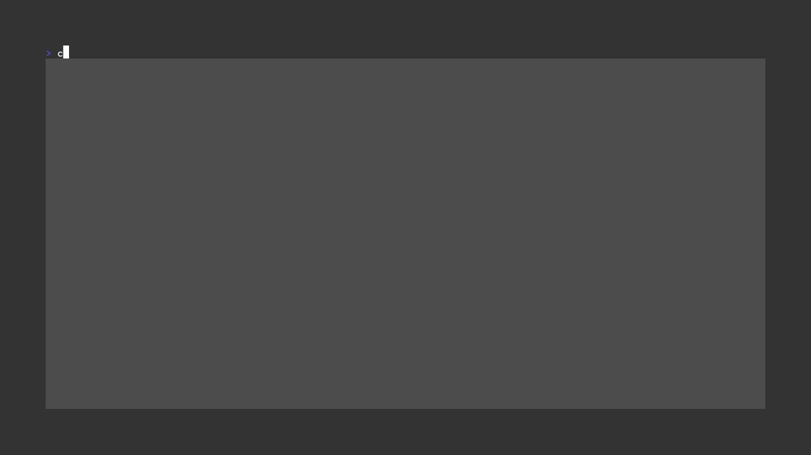

<p align="center">
    
</p>

👋 Hello! This is an RSS reader which allows you to browse the web better! It's accompanied by a beautiful TUI made with [bubble tea](https://github.com/charmbracelet/bubbletea)

## 🌃 Getting started

Getting it up and running is pretty easy! This is how you do it.

### 1. Clone the repository

```sh
git clone --depth=1 https://github.com/TypicalAM/goread && cd goread
```

### 2. Build the executable

#### On linux

```sh
go build -o goread cmd/main.go
```

#### On windows

```sh
go build -o goread.exe cmd/main.go
```

### 3. Run the program!

```sh
./goread --help
```

## ✨ Tasks to do

Here are the things that I've not yet implemented

- [X] Help interface with the key bindings
- [X] Better action keys
- [ ] Moving list items up/down
- [ ] A main category where all the feeds are aggregated

## 📸 Here is a demo of what it looks like:

Here is some basic usage:

<p align="center">
    
</p>

<p align="center">
    
</p>

Here we use `pywal` to generate a colorscheme and then convert it to a goread colorscheme!

<p align="center">
    
</p>

## 💁 Credit where credit is due

### Libraries

The demo was made using [vhs](https://github.com/charmbracelet/vhs/), which is an amazing tool, and you should definitely check it out. The entirety of [charm.sh](https://charm.sh) libraries was essential to the development of this project.

### Fonts & logo

The font in use for the logo is sen-regular designed by "Philatype" and licensed under Open Font License. The icon was designed by throwaway icons.

